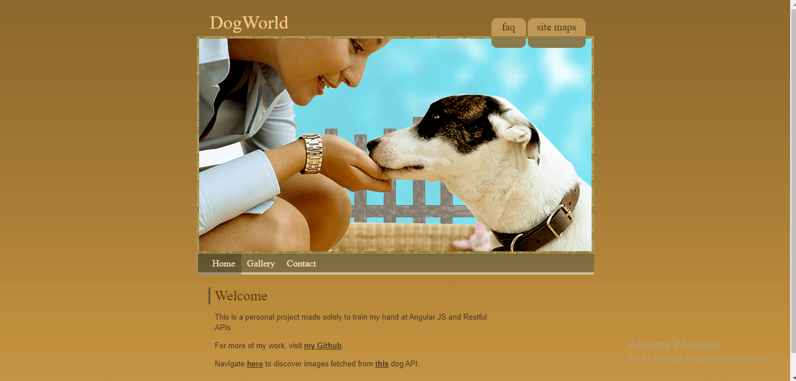
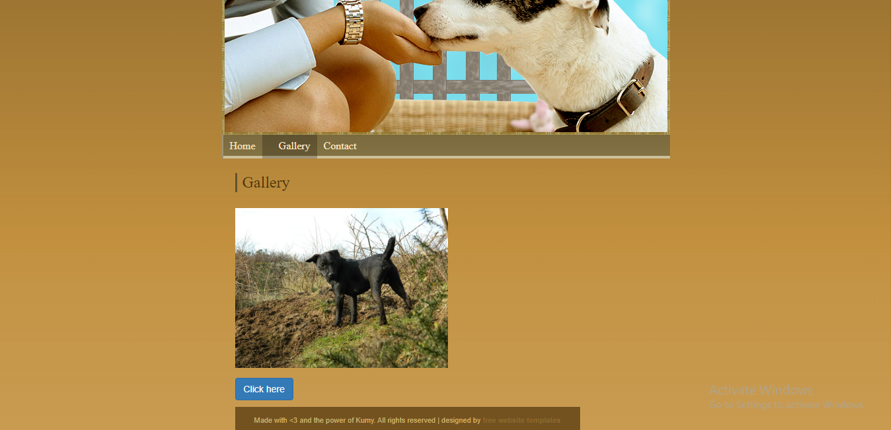

# DogWorld

Using <a href="https://dog.ceo/dog-api/">this</a> api, I was able to use Angular JS to fetch pictures of adorable dogs uploaded by dog lovers such as yourself!

The home page.

The gallery page.

After refreshing images.
